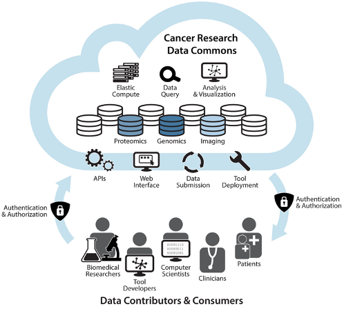

# Introduction

The NCI Cancer Research Data Commons (CRDC) is a cloud-based data science infrastructure that connects data sets with analytics tools to allow users to share, integrate, analyze, and visualize cancer research data to drive scientific discovery. 

This document serves as a reference of the current architecture and a roadmap for future growth based on NCI strategic initiatives and community input.

## CRDC Principles
The CRDC is growing to include a wider range of data. The fundamental principles used in the development and operations of the CRDC include:
- building with the input and collaboration of the broad research community.
- building in an open and modular way to make components extendable and reusable.
- ensuring broad interoperability, by basing the Data Commons on standards developed by coalitions, such as:
    - The Global Alliance for Genomics and Health (GA4GH),
    - Digital Imaging and Communications in Medicine (DICOM), and the
    - Clinical Data Interchange Standards Consortium (CDISC).
- striving for FAIR principles of data stewardship: Findability, Accessibility, Interoperability, and Reusability.
